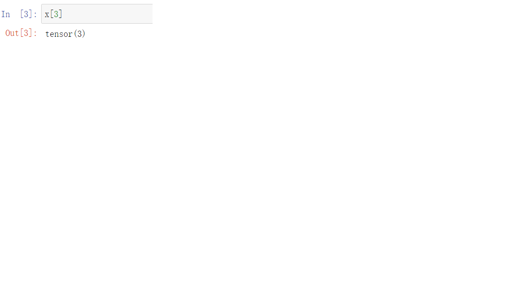
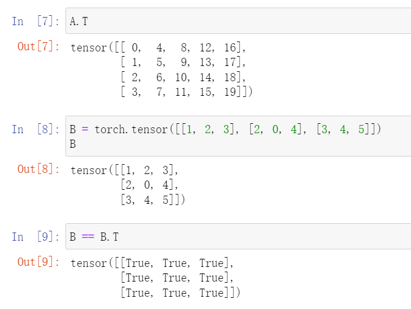
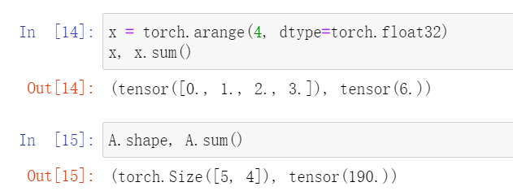

# 线性代数实现

## 1、标量

### 代码

```python
import torch

x = torch.tensor(3.0)
y = torch.tensor(2.0)

x + y, x * y, x / y, x**y
```

### 运行


## 2、向量是标量组成的列表


## 3、张量索引



## 4、长度


## 5、形状


## 6、矩阵


## 7、矩阵的转置


## 8、对称矩阵



## 9、多维矩阵


## 10、相同形状张量的二元运算

### (1)加法


### (2)哈达玛积：按元素乘法，数学符号⊙


## 11、和



## 12、按指定的轴求和


## 13、均值


## 14、轴数不变


## 15、累积


## 16、点积


## 17、矩阵乘以向量


## 18、矩阵乘以矩阵


## 19、L2范数


## 20、L1范数


## 21、矩阵的弗罗贝尼乌斯范数（Frobenius norm）


