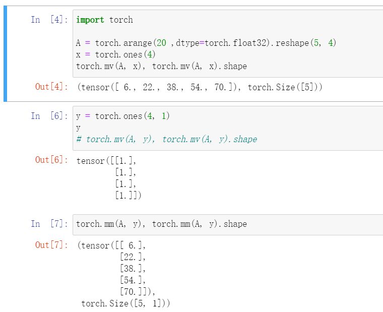

# QA

1. 数值稀疏的影响

    答：用稀疏矩阵存储即可。

2. 为什么深度学习用张量表示

    答：统计学家的数学的计算机表示

3. = copy.copy() copy.deepcopy() detech() clone()区别。

    3.1 = copy deepcopy区别
    > [= copy deepcopy区别](https://blog.csdn.net/u011630575/article/details/78604226?spm=1001.2101.3001.6650.4&utm_medium=distribute.pc_relevant.none-task-blog-2%7Edefault%7ECTRLIST%7ERate-4.pc_relevant_paycolumn_v3&depth_1-utm_source=distribute.pc_relevant.none-task-blog-2%7Edefault%7ECTRLIST%7ERate-4.pc_relevant_paycolumn_v3&utm_relevant_index=9)  

    > 首先直接上结论：  
    
    >深复制，即将被复制对象完全再复制一遍作为独立的新个体单独存在。所以改变原有被复制对象不会对已经复制出来的新对象产生影响。   
    而等于赋值，并不会产生一个独立的对象单独存在，他只是将原有的数据块打上一个新标签，所以当其中一个标签被改变的时候，数据块就会发生变化，另一个标签也会随之改变。  

    > 而浅复制要分两种情况进行讨论：  
    1）当浅复制的值是不可变对象（数值，字符串，元组）时和“等于赋值”的情况一样，对象的id值与浅复制原来的值相同。  
    2）当浅复制的值是可变对象（列表和元组）时会产生一个“不是那么独立的对象”存在。有两种情况：  
    >> 第一种情况：复制的 对象中无 复杂 子对象，原来值的改变并不会影响浅复制的值，同时浅复制的值改变也并不会影响原来的值。原来值的id值与浅复制原来的值不同。  
    第二种情况：复制的对象中有 复杂 子对象 （例如列表中的一个子元素是一个列表），如果不改变其中复杂子对象，浅复制的值改变并不会影响原来的值。 但是改变原来的值 中的复杂子对象的值  会影响浅复制的值。  
    对于简单的 object，例如不可变对象（数值，字符串，元组），用 shallow copy 和 deep copy 没区别  
    复杂的 object， 如 list 中套着 list 的情况，shallow copy 中的 子list，并未从原 object 真的「独立」出来。也就是说，如果你改变原 object 的子 list 中的一个元素，你的 copy 就会跟着一起变。这跟我们直觉上对「复制」的理解不同。

    3.2 detch clone
    > detach()操作后的tensor与原始tensor共享数据内存，当原始tensor在计算图中数值发生反向传播等更新之后，detach()的tensor值也发生了改变。detach()函数可以返回一个完全相同的tensor,与旧的tensor共享内存，脱离计算图，不会牵扯梯度计算。

    > 返回一个和源张量同shape、dtype和device的张量，与源张量不共享数据内存，但提供梯度的回溯。

4. 对哪一维求和就是消除哪一维

5. torch不区分行向量和列向量吗？
   

6. sum(axis=[0,1])怎么求？
    
    答：先按第0维求和，再按第1维求和。

7. torch中L1，L2正则化项的加入

