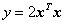
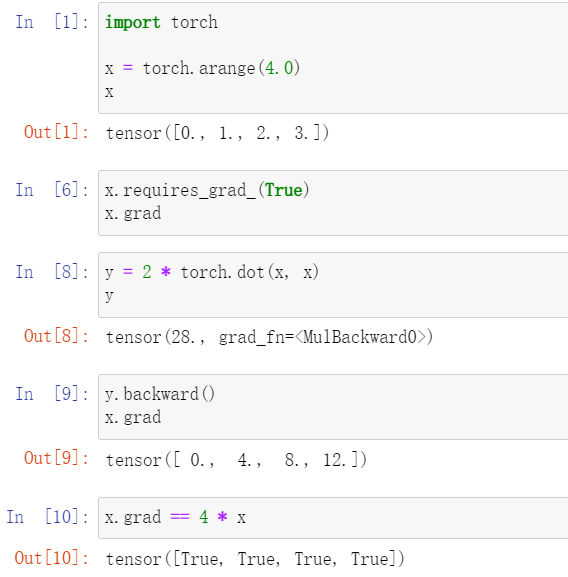
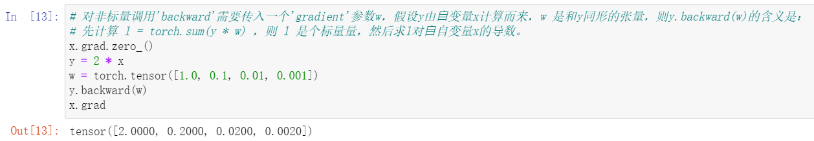
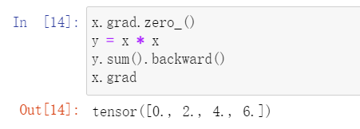
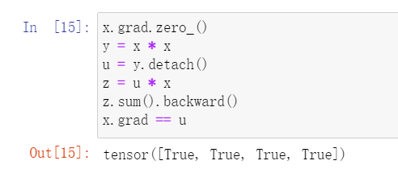
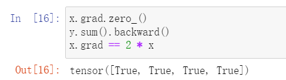
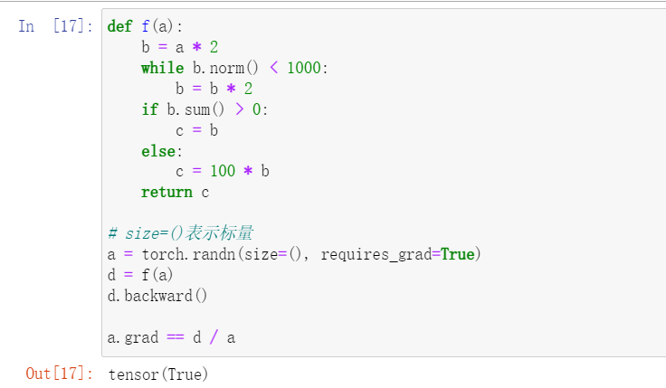

# 自动求导

1. 对函数  求导

    

2. 清除累积梯度

    

3. 深度学习中，我们的目的不是计算微分矩阵，而是批量中每个样本单独计算的偏导数之和
   
   

   

4. 将某些计算移动到记录的计算图之外

    

    

5. 即使构建函数的计算图需要通过python控制流（例如，条件、循环或任意函数调用），我们仍然可以计算得到变量的梯度

    