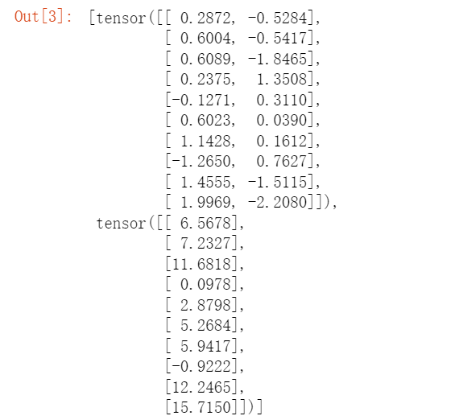
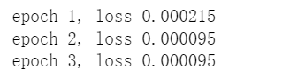

# 线性回归的简洁实现

1. 通过使用深度学习框架来简洁地实现线性回归模型生成数据集

## code

```python
import numpy as np
import torch
from torch.utils import data
from d2l import torch as d2l

true_w = torch.tensor([2, -3.4])
true_b = 4.2
features, labels = d2l.synthetic_data(true_w, true_b, 1000)
```

2. 调用框架中现有的API来读数据

## code

```python
def load_array(data_arrays, batch_size, is_train=True):
    """g构造一个PyTorch数据迭代器"""
    dataset = data.TensorDataset(*data_arrays)
    return data.DataLoader(dataset, batch_size, shuffle=is_train)

batch_size = 10
data_iter = load_array((features, labels), batch_size)

next(iter(data_iter))
```

## result



3. 使用框架预定义好的层

```python
from torch import nn

net = nn.Sequential(nn.Linear(2, 1))
```

4. 初始化模型参数

```python
net[0].weight.data.normal_(0, 0.01)
net[0].bias.data.fill_(0)
```

5. 计算均方误差使用的是MSELoss类，也称为平方范数

```python
loss = nn.MSELoss()
```

6. 实例化SGD实例

```python
trainer = torch.optim.SGD(net.parameters(), lr=0.03)
```

7. 训练过程

## code

```python
num_epochs = 3
for epoch in range(num_epochs):
    for X, y in data_iter:
        l = loss(net(X), y)
        trainer.zero_grad()
        l.backward()
        trainer.step()
    l = loss(net(features), labels)
    print(f'epoch {epoch + 1}, loss {l:f}')
```

## result

