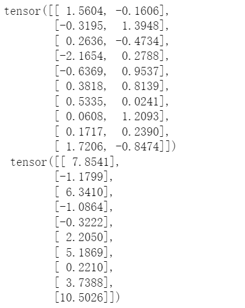

# 线性回归的从零开始实现

1. 根据带有噪声的线性模型构造一个人造数据集。使用线性模型参数 、和噪声项ε生成数据集及其标签：

<div align=center>

</div>

## code

```python
%matplotlib inline
import random
import torch
from d2l import torch as d2l

def synthetic_data(w, b, num_examples):
    """生成y=Xw+b+噪声。"""
    X = torch.normal(0, 1, (num_examples, len(w)))
    y = torch.matmul(X, w) + b
    y += torch.normal(0, 0.01, y.shape)
    return X, y.reshape((-1, 1))

true_w = torch.tensor([2, -3.4])
true_b = 4.2
features, labels = synthetic_data(true_w, true_b, 1000)

print('features:', features[0], '\nlabel:', labels[0])
```

## result


features中的每一行都包含一个二维数据样本，labels中的每一行都包含一维标签值（一个标量）

## code

```python
d2l.set_figsize()
d2l.plt.scatter(features[:, -1].detach().numpy(),
               labels.detach().numpy(), 1)
```

## result


2. 定义一个data_iter函数，该函数接受批量大小、特征矩阵和标签向量作为输入，生成大小为batch_size的小批量

## code

```python
def data_iter(batch_size, features, labels):
    num_examples = len(features)
    indices = list(range(num_examples))
    # 样本随机读取，没有特定顺序
    random.shuffle(indices)
    for i in range(0, num_examples, batch_size):
        batch_indices = torch.tensor(
            indices[i:min(i + batch_size, num_examples)])
        yield features[batch_indices], labels[batch_indices]

batch_size = 10

for X, y in data_iter(batch_size, features, labels):
    print(X, '\n', y)
    break
```

## result



3. 定义初始化模型参数
   
```python
w = torch.normal(0, 0.01, size=(2, 1), requires_grad=True)
b = torch.zeros(1, requires_grad=True)
```

4. 定义模型

```python
def linreg(X, w, b):
    """线性回归模型"""
    return torch.matmul(X, w) + b
```

5. 定义损失函数

```python
def squared_loss(y_hat, y):
    """均方损失"""
    return (y_hat - y.reshape(y_hat.shape))**2 / 2
```

6. 定义优化算法

```python
def sgd(params, lr, batch_size):
    """小批量随机梯度下降"""
    with torch.no_grad():
        for param in params:
            param -= lr * param.grad / batch_size
            param.grad.zero_()
```

7. 训练过程

## code

```python
lr = 0.03
num_epochs = 3
net = linreg
loss = squared_loss

for epoch in range(num_epochs):
    for X, y in data_iter(batch_size, features, labels):
        l = loss(net(X, w, b), y)    # 小批量损失
        l.sum().backward()
        sgd([w, b], lr, batch_size)
    with torch.no_grad():
        train_l = loss(net(features, w, b), labels)
        print(f'epoch {epoch + 1}, loss{float(train_l.mean()):f}')
```

## result


8. 比较真实参数和通过训练学到的参数来评估训练的成功程度

## code

```python
print(f'w的估计误差：{true_w - w.reshape(true_w.shape)}')
print(f'b的估计误差：{true_b - b}')
```

## result

