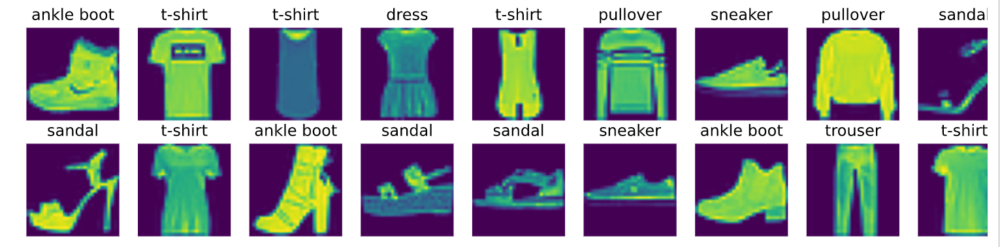

# 图像分类数据集

1. Fashion-MNIST

```python
%matplotlib inline
import torch
import torchvision
from torch.utils import data
from torchvision import transforms
from d2l import torch as d2l

d2l.use_svg_display()
```

2. 通过框架的内置函数将Fashion-MNIST数据及下载并读取到内存中

## code

```python
# 通过ToTensor实例将图像数据从PIL类型变换为32位浮点数格式
# 并除以255使得所有像素的数据均在0到1之间
trans = transforms.ToTensor()
mnist_train = torchvision.datasets.FashionMNIST(root="../data",train=True,
                                                transform=trans,
                                                download=True
                                               )
mnist_test = torchvision.datasets.FashionMNIST(root="../data",train=False,
                                                transform=trans,
                                                download=True
                                               )
len(mnist_train), len(mnist_test), mnist_train[0][0].shape
```

## result


3. 两个可视化数据集的函数

## code

```pythhon
def get_fashion_mnist_labels(labels):
    '''返回Fashion-MNIST数据集的文本标签'''
    text_labels = [
        't-shirt', 'trouser', 'pullover', 'dress', 'coat', 'sandal', 'shirt',
        'sneaker', 'bag', 'ankle boot'
    ]
    return [text_labels[int(i)] for i in labels]

def show_images(imgs, num_rows, num_cols, titles=None, scale=1.5):
    """Plot is a list of images."""
    figsize = (num_cols * scale, num_rows * scale)
    _, axes = d2l.plt.subplots(num_rows, num_cols, figsize=figsize)
    axes = axes.flatten()
    for i, (ax, img) in enumerate(zip(axes, imgs)):
        if torch.is_tensor(img):
            # 图片张量
            ax.imshow(img.numpy())
            ax.axis('off')
            ax.set_title(titles[i])
        else:
            # PIL图片
            ax.imshow(img)
```

4. 几个样本的图像及其相应的标签

## code

```python
X, y = next(iter(data.DataLoader(mnist_train, batch_size=18)))
show_images(X.reshape(18, 28, 28), 2, 9, titles=get_fashion_mnist_labels(y))
```

## result



5. 读取一小批量数据，大小为batch_size
   
```python
batch_size = 256

def get_dataloader_workers():
    """使用4个进程来读取的数据"""
    return 4

train_iter = data.DataLoader(mnist_train, batch_size, shuffle=True,
                            num_workers=get_dataloader_workers())

timer = d2l.Timer()
for X, y in train_iter:
    continue
print(f'{timer.stop():.2f} sec')
```

## result


6. 定义load_data_fashion_mnist函数

```python
def load_data_fashion_mnist(batch_size, resize=None):
    """下载Fashion-MNIST数据集， 然后将其加载到内存中。"""
    trans = [transforms.ToTensor()]
    if resize:
        trans.insert(0, transfoems.Resize(resize))
    trans = transforms.Compose(trans)
    mnist_train = torchvision.datasets.FashionMNIST(root="../data",
                                                   train=True,transform=trans,
                                                   download=False)
    mnist_test = torchvision.datasets.FashionMNIST(root="../data",
                                                   train=False,transform=trans,
                                                   download=False)
    return (data.DataLoader(mnist_train,batch_size, shuffle=True,
                           num_workers=get_dataloader_workers()),
           data.DataLoader(mnist_test,batch_size, shuffle=False,
                           num_workers=get_dataloader_workers()))
```